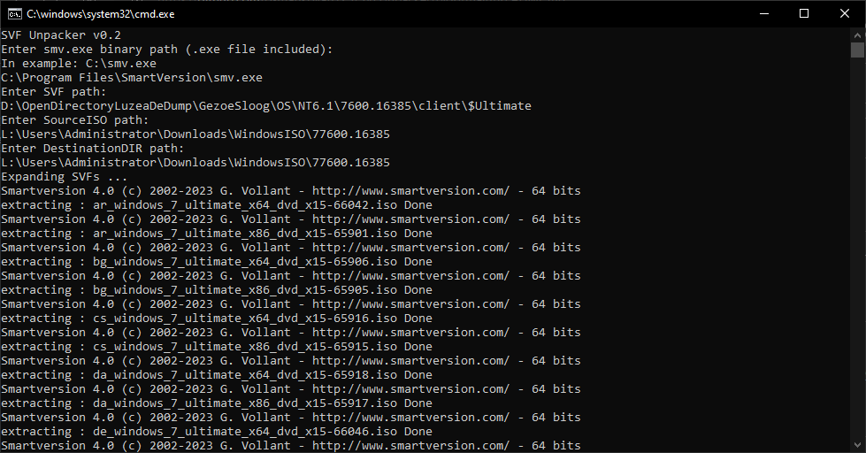

# SVFUnpacker - Windows
It lets you unpack multiple SVFs in one go. Currently, it doesn't have directory recursion.

## Credits
- [Me](https://github.com/eflanili7881) for writing script.
- [Gilles Vollant](https://github.com/gvollant) for [SmartVersion](https://github.com/gvollant/smartversion)'s smv.exe binary.

## What does this script do?
This script expands all of your SVF files in one go. I primarily developed this script for unpacking SVF patches for MSDN ISO files. That's why script says SourceISO in itself. But you can use this script in multiple areas.

## Instruction
- Fill required areas.
  - Enter smv.exe binary path.
    - The file path that's smv.exe.
      - Binary name doesn't need to be **smv.exe**. Just to be sure content of file is identical to smv.exe.
      - You don't need to enter **"**'s if path has spaces in it.
  - Enter SVF path.
    - The folder path that contains *.svf files.
      - Currently, script not support extract *.svf's from multiple folders. It'll be implemented.
      - You don't need to enter **"**'s if path has spaces in it.
  - Enter SourceISO path.
    - The folder path that contains source *.iso files.
      - You don't need to enter **"**'s if path has spaces in it.
  - Enter DestinationDIR path.
    - The folder path where you're gonna expand target ISO's.
      - You don't need to enter **"**'s if path has spaces in it.
- See the script does it's magic. Here's an example when I'm unpacking Windows 7 Ultimate build 7600 patches:

  

## What is SVF?
You can think SVF is small patch for a get another file that has very similar content compared to source file, but that file has some differences against source file. This file contains differences between source file against target file and target file's metadata. Source file **MUST** have correct checksum for get correct target file via SVF.

In example, you may have Vista's RTM 6000 x64 English ISO (3.53GB). But you may want to download Turkish variant of this ISO (3.18GB). You may have slow internet, but if you download small patch for that file (164.09MB on https://ow.owowo.workers.dev/dl?id=7vRrvWlkXTC%2Flp06S6hZcp5YHVSm7bHT6Jr8QNzxKJppWBvpc3eB5M2dKcW6yB5lqGVNINZI4ytdZnDu4Yth7Fw%3D&iv=XeMflxaVIZJ%2FSS0r), you can get Turkish variant with that small patch. Just downloading 2 files (3.7GB), you'll get content worth of 6.71GB with saving ~%45 bandwidth.

So, equation is like this:
| Source file | Patch file | Target file |
| :-: | :-: | :-: |
| en_windows_vista_x64_dvd_x12-40712.iso (3.53GB) | [tr-tr]_tr_windows_vista_x64_dvd_x12-61213.svf (164.09MB) | tr_windows_vista_x64_dvd_x12-61213.iso (3.18GB) |

## Troubleshooting
### Some files say "error detected: bad checksum"

This indicates:
- That your downloaded source image is incorrect/corrupt.
- Or worse thing is your RAM/(-s) is/(are) defective.

You can fix this by verifying that's your image is downloaded properly or finding broken addresses via PassMark Memtest86 or another memory error detecting software, adding these addresses to BCD on Windows to prevent that addresses used by your system.

### Some files say "error detected: IO Error"
### filename : (fullPathToTheSourceFileThat'sMissing)
### message : The system cannot find the file specified.

This indicates source file's:
- Exists where you want to give source file variable, but you supplied wrong path to source file variable.
- Missing from given location to source file variable.
- Contents are same as it should, but it's name is different from name that's inside of SVF file.

You can fix this by downloading/moving/renaming source file to path that you supplied to source file variable or changing path that's supplied to source file variable to right one.
